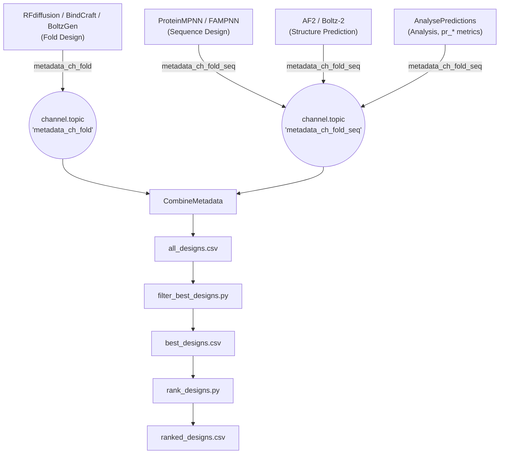

[🏠 ProteinDJ](../README.md) > Integrating New Metrics

# Integrating New Metrics into ProteinDJ

This document reverse-engineers how metrics/metadata flow from each pipeline stage into
`all_designs.csv`/`best_designs.csv`/`ranked_designs.csv`, and provides a checklist/template for
adding a **new** metric — whether that's a brand-new calculation added to the post-prediction
Analysis stage, or a new field extracted from an existing tool's output (RFdiffusion, BindCraft,
BoltzGen, MPNN, FAMPNN, AF2, Boltz-2).

See [docs/metrics.md](metrics.md) for the existing metric catalogue and
[docs/parameters.md](parameters.md) for the existing filter parameters — this document explains
the machinery that produces/consumes both.

---

## 1. Pipeline architecture recap

Every stage that produces per-design metadata writes it to a small JSON/JSONL file and emits that
file on one of two Nextflow **topic channels**, keyed by ID granularity:



- **`metadata_ch_fold`**: metadata keyed only by `fold_id` (one row per backbone/fold — e.g.
  RFdiffusion timing, BindCraft fold-level pLDDT, fold secondary structure).
- **`metadata_ch_fold_seq`**: metadata keyed by both `fold_id` and `seq_id` (one row per designed
  sequence — e.g. MPNN score, AF2/Boltz prediction confidence, Analysis biophysical metrics).

Every process that produces metadata declares this in its `output:` block, e.g.
([modules/boltz.nf](../modules/boltz.nf)):

```groovy
path ("boltz_metadata_*.jsonl"), topic: metadata_ch_fold_seq
```

In [main.nf](../main.nf), both topics are drained, concatenated to a single JSONL file each, and
merged into one CSV:

```groovy
channel.topic('metadata_ch_fold').flatten()
    .collectFile(name: "metadata_fold.jsonl", newLine: true)
    .ifEmpty { file("${projectDir}/lib/empty-meta.jsonl") }
    .set { metadata_fold }

channel.topic('metadata_ch_fold_seq').flatten()
    .collectFile(name: "metadata_fold_seq.jsonl", newLine: true)
    .ifEmpty { file("${projectDir}/lib/empty-meta.jsonl") }
    .set { metadata_fold_seq }

CombineMetadata(metadata_fold, metadata_fold_seq).csv
    .collectFile(name: "all_designs.csv")
    .set { all_designs_metadata }
```

`CombineMetadata` ([modules/combine_metadata.nf](../modules/combine_metadata.nf)) just calls
[scripts/metadata_converter.py](../scripts/metadata_converter.py)'s `merge_all()`, which:

1. Groups `metadata_fold.jsonl` records by `fold_id`.
2. Groups `metadata_fold_seq.jsonl` records by `(fold_id, seq_id)`, and merges in the matching
   fold-only record (so fold-level fields like `rfd_sampled_mask` get broadcast onto every
   sequence row sharing that fold).
3. Builds one combined `pandas.DataFrame` and writes it to `all_designs.csv`.

Later, [modules/publish.nf](../modules/publish.nf) runs [scripts/filter_best_designs.py](../scripts/filter_best_designs.py)
(keeps only rows for PDBs that survived every filtering stage → `best_designs.csv`) and,
optionally, [scripts/rank_designs.py](../scripts/rank_designs.py) (sorts by `--ranking-metric` →
`ranked_designs.csv`).

---

## 2. The metadata contract

Any JSON/JSONL record fed into either topic channel must follow these rules:

| Requirement | Details |
|---|---|
| **ID fields** | Every record needs `fold_id` (int). Fold+seq-level records also need `seq_id` (int). IDs are usually derived from the `fold_N_seq_M` filename convention via a regex (see `derive_ids_from_filename()` in [scripts/analyse_best_designs.py](../scripts/analyse_best_designs.py) or the equivalent in each converter class). |
| **`description` field** | Fold+seq-level records should include `description` (the design's base filename, no extension) — used by `filter_best_designs.py`/`rank_designs.py` to match CSV rows back to PDB files. |
| **Correct topic** | Use `metadata_ch_fold` for fold-only metadata, `metadata_ch_fold_seq` for anything keyed by a specific designed sequence. Getting this wrong either loses the seq_id granularity or fails to broadcast a fold-level value across its sequences. |
| **Prefixed field names** | Every metric key must be prefixed by its tool/stage, e.g. `rfd_`, `bc_`, `bg_`, `fampnn_`, `mpnn_`, `af2_`, `boltz_`, `pr_` (Analysis), `seq_` (sequence properties). Pick a short, unused prefix for a genuinely new tool. |
| **Flat, JSON-serializable values** | Records are written with plain `json.dumps()` — use native `int`/`float`/`str`/`bool`/lists, not numpy types or other non-serializable objects (see `RFDMetadataConverter._parse_metadata()`'s explicit numpy→list conversion and stringify-fallback for anything else). |
| **Registered in `metadata_field_names`** | ⚠️ **Critical, easy to miss**: `metadata_converter.py::merge_all()` reindexes the final DataFrame to a hardcoded `metadata_field_names` list (grouped by stage, with a comment header per section) before writing the CSV — **any column not in that list is silently dropped**, even though it was present in the JSONL. A new metric key must be added to this list or it will never appear in `all_designs.csv`. |

---

## 3. Two ways to add a metric

### A. New metric computed by `analyse_best_designs.py` (Analysis stage, `pr_*`)

This is the most common case for a genuinely new biophysical/structural metric, since the
Analysis stage already has a relaxed structure and parsed BioPython `Model` for every design.

1. Add a `calculate_*()` function in [scripts/analyse_best_designs.py](../scripts/analyse_best_designs.py)
   that returns a `{'pr_my_metric': value, ...}` dict (follow the existing per-chain-suffix
   convention: append `_{chain_id}` to the key for any chain other than `A`, see
   `calculate_chain_metrics()`).
2. Call it from `process_single_pdb()` and `metrics.update(...)` the result, in the monomer/binder
   (2-chain)/oligomer (3+ chain) branch(es) it applies to.
3. Because `AnalysePredictions` already emits `best_designs.jsonl` on the `metadata_ch_fold_seq`
   topic, no Nextflow wiring changes are needed — the new key flows through automatically once
   step 4 below is done.
4. Add `'pr_my_metric'` to `metadata_field_names` in `metadata_converter.py::merge_all()` (under
   the `# Prediction Analysis fields` section).

### B. New metric extracted from an existing tool's native output

For a metric that an upstream tool (RFdiffusion, BindCraft, BoltzGen, MPNN, FAMPNN, AF2, Boltz-2)
already produces but ProteinDJ doesn't yet surface:

1. Find the parser that turns that tool's native output into JSON/JSONL:
   - RFdiffusion `.trb` files → `RFDMetadataConverter` in `metadata_converter.py` (generic:
     prefixes every key in the pickle with `rfd_` automatically — usually nothing to change here).
   - AF2 `score.sc` → `AF2MetadataConverter` in `metadata_converter.py` (explicit `float_fields`
     set + prefixing; add the new column name to `float_fields` if it needs numeric rounding).
   - Boltz-2 prediction JSON → [scripts/align_boltz.py](../scripts/align_boltz.py)'s
     `align_structures()` (builds the `out_json` dict explicitly — add a new `"boltz_my_metric":
     ...` key there, reading from Boltz's raw `data` dict or `analyse_boltz_batch.py`'s
     interface-scoring output).
   - MPNN/FAMPNN → `MPNNMetadataConverter`/`FAMPNNMetadataConverter` in `metadata_converter.py`
     (explicit dict construction from the tool's JSON — add a new key there).
   - BindCraft/BoltzGen → `BCMetadataConverter`/`BGMetadataConverter` (pass-through; the fields
     already come pre-named from `scripts/analyse_bindcraft.py`/`scripts/analyse_boltzgen.py` — add
     the new field there).
2. Register the new key in `metadata_field_names` (step 4 above).
3. No new topic-channel wiring is normally needed since the module already emits its
   `<stage>_metadata_*.jsonl` on the correct topic — check the corresponding `modules/*.nf` file
   only if you're adding a brand-new process rather than extending an existing one.

---

## 4. Making a metric filterable (optional)

Five independent per-stage filter scripts follow the same pattern: `fold` ([scripts/filter_fold.py](../scripts/filter_fold.py)),
`seq` ([scripts/filter_seq.py](../scripts/filter_seq.py)), `af2` ([scripts/filter_af2.py](../scripts/filter_af2.py)),
`boltz` ([scripts/filter_boltz.py](../scripts/filter_boltz.py)), and `pr`/Analysis
([scripts/filter_analysis.py](../scripts/filter_analysis.py)). To add a threshold for your new
metric (using `pr_my_metric` as the example, analogous for other prefixes):

1. **Filter script**: add an argparse flag (e.g. `--pr-max-my-metric`) and a
   `(metric_key, min_val, max_val, value_type)` tuple to the `filters` list in `filter_data()`.
2. **`main.nf`**: add the new suffix (e.g. `"max_my_metric"`) to the relevant
   `Utils.formatFilterParams(params, "pr", [...])` call (line ~117) — this generic helper
   ([lib/Utils.groovy](../lib/Utils.groovy)) turns `params.pr_max_my_metric` into
   `--pr-max-my-metric <value>` automatically, so the argparse flag name and the params key must
   match via simple `_` → `-` substitution.
3. **`nextflow.config`**: add `pr_max_my_metric = null` (with a one-line comment) next to the
   other `pr_*` filter defaults.
4. **`nextflow_schema.json`**: add a matching property (`"type"`, `"description"`,
   `"hidden": true`) to the same `definitions` block as the other `pr_*` filter params.
5. **`schemas/mode_parameters.csv`**: add a new row with the param name repeated in every
   `<mode>_parameters` column the param should appear in (leave the paired `<mode>_values` cell
   empty to keep the master schema's default; only set a value there to override the default for
   that specific mode, or to mark it required via the `__required__` sentinel row). ⚠️ **Critical,
   easy to miss**: `generate_mode_schemas.py::build_mode_schema()` only keeps properties whose name
   is a key in that mode's CSV column — a property with no row (or a blank cell in a given mode's
   `_parameters` column) in this CSV is **silently dropped from that mode's generated schema**,
   including the `custom` mode, even though it's present in the master `nextflow_schema.json`.
6. Run `scripts/regenerate_schemas.sh` to regenerate the per-mode
   `schemas/nextflow_schema_<mode>.json` files and bindsweeper's `binder_schema.json` from the
   updated master schema + CSV.
7. **Docs**: add rows to [docs/parameters.md](parameters.md) (filter defaults table + filter
   description table) and [docs/metrics.md](metrics.md) (metric description).

---

## 5. Making a metric usable for ranking (optional)

`rank_designs.py` sorts `best_designs.csv` by whatever column name is passed via
`--ranking-metric`, so in principle any numeric column works without code changes. Two gotchas:

- **`main.nf`'s `validateranking_metric()`** only accepts `ranking_metric` values starting with
  `af2_` or `boltz_` (matched to `params.pred_method`) — a user-supplied `pr_*`/`fold_*`/etc.
  metric will be rejected. Extend this function if analysis-stage metrics should become rankable.
- **Sort direction is inferred from the metric name**, not declared explicitly: `rank_designs.py`'s
  `rank_designs()` checks whether the metric name contains one of `['pae', 'rmsd', 'pde']`
  (ascending/lower-is-better) or `['ptm', 'plddt', 'conf', 'ipsae', 'lis', 'pdockq']`
  (descending/higher-is-better), defaulting to higher-is-better with a warning if neither matches.
  Name a new ranking-eligible metric to include one of these keywords where the direction matches
  its meaning, or extend the two keyword lists.

---

## 6. Checklist summary

| Step | File(s) | Required? |
|---|---|---|
| Compute the metric, return prefixed key(s) | The relevant stage script (see §3) | Always |
| Register key in `metadata_field_names` | [scripts/metadata_converter.py](../scripts/metadata_converter.py) | Always — otherwise silently dropped from the CSV |
| Emit on the correct topic | `modules/*.nf` (usually already wired if extending an existing process) | Always |
| Add filter CLI flag + `filters` list entry | The stage's `scripts/filter_*.py` | Only if filterable |
| Add param to `Utils.formatFilterParams(...)` call | [main.nf](../main.nf) | Only if filterable |
| Add `..._param = null` default | [nextflow.config](../nextflow.config) | Only if filterable |
| Add schema property | [nextflow_schema.json](../nextflow_schema.json) | Only if filterable |
| Add a row for the param | [schemas/mode_parameters.csv](../schemas/mode_parameters.csv) | Only if filterable — otherwise silently dropped from every per-mode schema, including `custom` |
| Regenerate derived schemas | `scripts/regenerate_schemas.sh` | Only if filterable |
| Extend `validateranking_metric`/keyword lists | [main.nf](../main.nf) / [scripts/rank_designs.py](../scripts/rank_designs.py) | Only if rankable and not af2_/boltz_ prefixed |
| Document the metric | [docs/metrics.md](metrics.md) | Always |
| Document the filter param(s) | [docs/parameters.md](parameters.md) | Only if filterable |

---

[⬅️ Back to Main README](../README.md)
