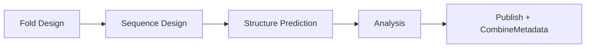

# Integrating a New Fold Design Tool into ProteinDJ

This document reverse-engineers how **BindCraft** was integrated into ProteinDJ as an
alternative to RFdiffusion for the "Fold Design" stage. It is intended as a template/checklist
for integrating other binder (or monomer) fold-generation tools (e.g. BoltzGen, AlphaProteo-style
hallucination tools, etc.) into the pipeline.

BindCraft is a good reference case because, unlike RFdiffusion, it is a fully independent
external tool with its own opinions about chain order, output format, and settings files —
so the "adapter" code needed to make it conform to ProteinDJ's internal conventions is fully
exposed and easy to study.

---

## 1. Pipeline architecture recap

ProteinDJ ([main.nf](../main.nf)) is a linear 4-stage pipeline, each stage optionally skippable:



- **Fold Design** — generates backbone/fold structures (RFdiffusion *or* BindCraft today).
- **Sequence Design** — ProteinMPNN or FAMPNN assign sequences to the fold(s).
- **Structure Prediction** — AlphaFold2-Initial-Guess or Boltz-2 re-predicts structure for validation.
- **Analysis** — PDBFixer/OpenMM/arpeggia/PRODIGY/BioPython-based metric calculation, ranking, filtering.

Each stage is swappable via a top-level `params` switch (`design_mode` chooses the fold-design
engine implicitly, `seq_method` chooses MPNN/FAMPNN, `pred_method` chooses AF2/Boltz). This means
**a new fold design tool is just another branch of the same `if/else` that currently distinguishes
`bindcraft_denovo` from the RFdiffusion-based modes** — see [main.nf](../main.nf) around the
`FOLD DESIGN STAGE` comment block.

Stages communicate via two mechanisms:
1. **Nextflow channels** carrying `tuple(pdb_files, json_files)` pairs between processes.
2. **Nextflow topic channels** (`metadata_ch_fold` and `metadata_ch_fold_seq`) which every process
   can publish JSONL metadata records to, regardless of which stage/tool produced them. These are
   collected at the end of the workflow and merged by
   [modules/combine_metadata.nf](../modules/combine_metadata.nf) /
   [scripts/metadata_converter.py](../scripts/metadata_converter.py) into `all_designs.csv`.

---

## 2. The "Fold Design" stage contract

Any tool plugged in as a fold-design engine must ultimately deliver, into the variable
`fold_tuples` (consumed by the shared `FilterFold` process), a Nextflow tuple of:

```
tuple( path(pdb_files), path(json_files) )
```

with these hard requirements:

| Requirement | Details |
|---|---|
| **1:1 PDB/JSON pairing** | Every design PDB (`fold_N.pdb`/`batch_X...pdb`) must have a matching JSON metadata sidecar with the same basename convention. `Utils.rebatchTuples()` (see [lib/Utils.groovy](../lib/Utils.groovy)) uses `.transpose()` which zips PDB/JSON lists positionally — order must match. |
| **Sequential, unique `fold_id`** | JSON metadata must contain an integer `fold_id` field starting at 0 and unique across the whole run (not just per-batch). BindCraft's `analyse_bindcraft.py` explicitly re-numbers designs across all batches for this reason (`create_metadata_from_row(..., fold_id, ...)`). |
| **Binder chain convention** | For binder-design modes, the **binder must be chain A and the target chain(s) must come after** (e.g. chain B). BindCraft natively outputs the binder as chain B and target as chain A — the integration performs an explicit chain swap + renumbering (`swap_and_renumber_chains()` in [scripts/analyse_bindcraft.py](../scripts/analyse_bindcraft.py)) to conform to this convention, since downstream MPNN/FAMPNN/AF2/Boltz code assumes it. |
| **JSONL metadata emitted on a topic channel** | Any process that generates fold-only metadata publishes a `path(...jsonl), topic: metadata_ch_fold` output (see `RunRFD`'s `rfd_metadata_${batch_id}.jsonl` and `AnalyseBC`'s `bindcraft_metadata.jsonl` in [modules/bindcraft.nf](../modules/bindcraft.nf)). These get concatenated by Nextflow's topic-channel mechanism, so the emitting process does not need to know about other tools. |
| **Metadata field naming convention** | Fields are prefixed by tool: `rfd_*` for RFdiffusion, `bc_*` for BindCraft, `fold_*` for engine-agnostic fold filtering metrics (helices/strands/RoG — computed downstream by `FilterFold`, not by the tool itself). A new tool should use its own short prefix (e.g. `bg_*` for BoltzGen) to avoid clashes; see [scripts/metadata_converter.py](../scripts/metadata_converter.py)'s `metadata_field_names` list, which must be updated to include any new prefixed fields so they survive the CSV merge and column ordering step. |
| **Batching for GPU parallelism** | The fold design channel must be built so batches can run in parallel across `params.gpus` GPUs (see §4 below). |
| **`FilterFold` compatibility** | `FilterFold` ([modules/rfdiffusion.nf](../modules/rfdiffusion.nf)) is shared/generic — it computes secondary structure and radius-of-gyration filters on chain A (binder) or all chains (monomer). It doesn't care which tool produced the PDBs, only that the naming/pairing/chain conventions above are followed. |

---

## 3. Case study: how BindCraft satisfies the contract

### 3.1 Container & process labels

- Dockerfile/def: [apptainer/bindcraft.def](../apptainer/bindcraft.def) builds a conda env
  (`BindCraft`) with a pinned fork (`FreeBindCraft`, PyRosetta-free), JAX+CUDA, ColabDesign, etc.
- [nextflow.config](../nextflow.config) declares a process label block:
  ```groovy
  withLabel: BC {
      container = "${params.container_registry}/bindcraft:${params.container_version}"
      containerOptions = """--nv \
          --bind ${params.af2_models}:/af2params \
          """
  }
  ```
  Notice BindCraft reuses the existing `params.af2_models` bind (it needs AF2 multimer weights for
  hallucination) rather than declaring a new model-path param — reuse existing params where the
  underlying tool need is genuinely the same.
- Processes are annotated `label 'BC'` (GPU process) or `label 'python_tools'` (CPU pre/post
  processing, using the already-existing generic Python container with BioPython/pandas).

### 3.2 Module structure ([modules/bindcraft.nf](../modules/bindcraft.nf))

Three processes mirror the RFdiffusion module's `Generate*`/`RunRFD`/`FilterFold` shape:

1. **`PrepBC`** (`python_tools`) — per-batch prep. Converts ProteinDJ params into BindCraft's own
   settings JSON schema (`design_path`, `binder_name`, `chains`, `target_hotspot_residues`,
   `lengths`, `number_of_final_designs`), auto-detects target chains from the PDB if
   `bc_chains` is null (via BioPython `PDBParser`), and patches the advanced-settings JSON:
   - forces `enable_mpnn=False` (BindCraft's internal MPNN is disabled — ProteinDJ does its own
     sequence design downstream, this is the key adapter decision that keeps BindCraft "fold-only")
   - sets `max_trajectories` to the batch size (BindCraft doesn't have a hard requested-count
     parameter — it will loop, generating trajectories, until either `number_of_final_designs` is
     hit or `max_trajectories` is exhausted; capping `max_trajectories == batch_size` guarantees
     bounded runtime per batch)
   - points `af_params_dir` at the container bind path for AF2 weights.

2. **`RunBC`** (`BC`, `gpu`) — runs `bindcraft.py --no-pyrosetta --settings ... --filters ...
   --advanced ...` for one batch. Renames the output CSV to `batch_<id>.csv` only if at least one
   design passed BindCraft's own internal filters (BindCraft can reject 100% of trajectories,
   emitting nothing — this is handled with `optional: true` on the output and an `ifEmpty`
   downstream, exactly like the RFdiffusion/other tools' zero-design edge case).

3. **`AnalyseBC`** (`python_tools`) — collects **all** batch outputs (`.collect()`'d across GPUs)
   and:
   - chain-swaps + renumbers every PDB (binder → chain A convention, see contract §2)
   - assigns new sequential `fold_id`s across the whole run
   - converts BindCraft's per-trajectory CSV row into a `bc_*`-prefixed metadata JSON per design
     (`bc_length`, `bc_plddt`, `bc_rmsd_target`, `bc_time`, plus a synthesized `bc_inpaint_seq`
     boolean mask — following the same convention as RFdiffusion's `rfd_inpaint_seq` so that if
     `bc_fix_interface_residues` is set, MPNN/FAMPNN downstream can still "fix" the interface
     using the same mechanism as RFdiffusion motif scaffolding does)
   - runs `metadata_converter.py --converter bc` to emit the `bindcraft_metadata.jsonl` topic
     output.

### 3.3 `main.nf` integration point

Inside the `if (!params.skip_fold ...)` block, `design_mode` is checked once:

```groovy
if (params.design_mode=="bindcraft_denovo"){
    // validate BindCraft-only params, pick advanced-settings/filters JSON,
    // build a per-batch channel of batch indices, PrepBC -> RunBC -> AnalyseBC -> CompressBC
    // then Utils.rebatchTuples(bc_pdbs_jsons, 200) -> fold_tuples
} else {
    // existing RFdiffusion contig-generation / fold-conditioning / partial-diffusion logic
    // ... -> RunRFD -> Utils.rebatchTuples(rfd_pdbs_jsons, 200) -> fold_tuples
}
// FilterFold(fold_tuples) runs identically regardless of branch taken above
```

Key point for future tools: **both branches converge on the same `fold_tuples` variable name and
shape**, so `FilterFold` and everything downstream is completely tool-agnostic. A new tool is a
third `else if` branch (or, better, a `switch(params.design_mode)`/strategy dispatch if the number
of tools grows) that ends by setting `fold_tuples`.

Batching pattern used for BindCraft (simpler than RFdiffusion's, since BindCraft doesn't need
contigs/scaffolds):
```groovy
def num_batches = Math.min(params.gpus, params.num_designs).intValue()
def batch_size = Math.ceil(params.num_designs / num_batches).intValue()
bc_ch = Channel.fromList((0..<num_batches))
PrepBC(bc_ch, batch_size, file(params.input_pdb), bc_advanced_json)
RunBC(PrepBC.out, bc_filters_json, file(params.input_pdb))
```
i.e. one batch per GPU, each producing up to `batch_size` designs; `AnalyseBC` fans back in with
`.flatten().collect()`.

### 3.4 Parameters, schemas & docs

A new tool's params must be threaded through **four** places, all following the `<tool>_<name>`
prefix convention (`bc_*`, `rfd_*`, `mpnn_*`, `fampnn_*`, `af2_*`, `boltz_*`):

1. **[nextflow.config](../nextflow.config)** — declare params with defaults + doc comments under a
   `//// <TOOL> ADVANCED PARAMETERS ////` section (see `bc_chains`, `bc_design_protocol`,
   `bc_template_protocol`, `bc_omit_AAs`, `bc_fix_interface_residues`, `bc_advanced_json`).
2. **[schemas/mode_parameters.csv](../schemas/mode_parameters.csv)** — a big matrix of
   `<mode>_parameters,<mode>_values` column pairs used to generate the per-mode schemas below; add
   a column pair for the new mode and populate relevant rows (blank cells mean "not applicable to
   this mode"). Also populate the mode's cell in the special `__required__` row with a
   comma-separated list of mode-specific parameters that must be required for this mode (e.g.
   `input_pdb,rfd_contigs` for `rfd_motifscaff`) — this drives the `required` list of whichever
   definition group each named parameter lives in (e.g. `mode_specific_parameters` for `input_pdb`,
   `rfdiffusion_advanced_parameters` for `rfd_contigs`), replacing what used to be a hardcoded
   `MODE_REQUIRED_PARAMS` dict in `generate_mode_schemas.py`.
3. **[schemas/nextflow_schema_<mode>.json](../schemas/nextflow_schema_bindcraft_denovo.json)** — a
   JSON Schema (draft-07) per design mode, split into `essential_parameters`,
   `mode_specific_parameters`, `workflow_advanced_parameters`, `<tool>_advanced_parameters`, etc.
   groups, each with `type`, `description`, `pattern`/`enum` validation and `required` lists. This
   is what powers `nextflow_schema.json`/Seqera Platform parameter forms. Don't hand-edit these —
   run `./scripts/regenerate_schemas.sh` from the repo root after updating `nextflow_schema.json`
   and `mode_parameters.csv`; it regenerates every per-mode schema plus bindsweeper's
   `binder_schema.json` in one step.
4. **[docs/parameters.md](parameters.md)** and **[docs/modes.md](modes.md)** — human-readable
   parameter tables and a worked example / diagram for the new mode (see the "BindCraft Mode"
   section of modes.md, ``, and the `## BindCraft Advanced
   Parameters` table in parameters.md).

Also update `main.nf`'s `VALID_MODES` list and the mode-validation helper functions
(`validateBindCraftParams`, `getAdvancedSettingsPath`, `collectInputFiles`) — every new tool
generally needs an equivalent `validate<Tool>Params()` helper and an entry in `collectInputFiles()`
so its required input files get copied into `<out_dir>/inputs`.

### 3.5 Metadata plumbing

- [scripts/metadata_converter.py](../scripts/metadata_converter.py) needs:
  - a new `<Tool>MetadataConverter(MetadataConverter)` subclass implementing `_parse_metadata()`
    (see `BCMetadataConverter`, which just passes through pre-formatted JSON since `AnalyseBC`
    already writes fully-prefixed metadata — contrast with `AF2MetadataConverter`, which has to
    parse a raw Rosetta `score.sc` file and add prefixes/derive `fold_id`/`seq_id` from the
    `description` field via regex).
  - the new tool's field names added to the master `metadata_field_names` ordering list in
    `merge_all()`, otherwise they'll be silently dropped from the final CSV.
- `scripts/analyse_bindcraft.py` is a good template for any tool that needs non-trivial output
  normalization (chain reordering, renumbering, unit conversions like `parse_trajectory_time`).

### 3.6 Filters

BindCraft ships its own internal filtering system (`settings_filters/*.json`). ProteinDJ
deliberately uses [lib/bindcraft/settings_filters/no_filters.json](../lib/bindcraft/settings_filters)
(all filters disabled) since ProteinDJ performs its own filtering (`FilterFold`, `FilterSeq`,
`FilterAF2`/`FilterBoltz`, `FilterAnalysis`) uniformly across all tools — don't let the wrapped
tool's own opinionated filtering interfere with the pipeline's filtering stages unless there's no
alternative (e.g. BindCraft's own AF2-based hallucination-acceptance loop is unavoidable and kept).

BindCraft's advanced-settings variants (`default_4stage_multimer.json`,
`betasheet_4stage_multimer.json`, `peptide_3stage_multimer.json`, each with a `_flexible` variant)
are pre-supplied static config files selected by a small `switch` in `getAdvancedSettingsPath()`
based on two enum-like params (`bc_design_protocol`, `bc_template_protocol`) — this
"protocol tag → static JSON file" pattern is a clean way to expose a tool's preset combinations
without leaking every low-level knob into ProteinDJ's own params.

---

## 4. Generalized checklist for adding a new fold-design tool

Use BindCraft as the template. Concretely, to add tool `X` (prefix `x_`) as a new `design_mode`
value (e.g. `x_denovo`):

1. **Container**
   - [ ] Add `apptainer/x.def` (or Dockerfile) building the tool + a way to invoke it headlessly/CLI.
   - [ ] Add a `withLabel: X { container = ...; containerOptions = ... }` block to
     [nextflow.config](../nextflow.config)'s `process {}` scope. Reuse existing model-weight binds
     (`af2_models`, etc.) if the tool genuinely needs the same weights; otherwise add a new
     `x_models` param + bind (see the `bg_models` param and `BG` label in nextflow.config as a
     completed real-world example of this exact step, from the BoltzGen integration).
   - [ ] Add build/download entries to `apptainer/build_containers.sh` / `download_containers.sh`.

2. **Nextflow module** (`modules/x.nf`)
   - [ ] `PrepX` (CPU, `python_tools` label): translate ProteinDJ params → tool-native settings file(s).
   - [ ] `RunX` (GPU, `X` label): invoke the tool per-batch; handle the "zero designs survived"
     edge case with `optional: true` output.
   - [ ] `AnalyseX` (CPU, `python_tools` label): normalize chain order/numbering (binder must end
     up as chain A for binder modes), assign global sequential `fold_id`s, emit per-design
     `fold_N.pdb`/`fold_N.json` (or equivalent paired naming), and emit `x_metadata.jsonl` on the
     `metadata_ch_fold` topic via `metadata_converter.py --converter x`.

3. **`main.nf` wiring**
   - [ ] Add `'x_denovo'` (or however you name it) to `VALID_MODES`.
   - [ ] Add `include { PrepX; RunX; AnalyseX } from './modules/x.nf'` and
     `include { Compress as CompressX } from './modules/compress'`.
   - [ ] Add a new branch in the Fold Design stage `if/else` that builds the per-GPU batch channel,
     runs `PrepX -> RunX -> AnalyseX`, compresses with `CompressX`, and finishes with
     `Utils.rebatchTuples(x_pdbs_jsons, 200)` assigned to `fold_tuples` — matching the exact shape
     the BindCraft/RFdiffusion branches produce.
   - [ ] Add `validateXParams(...)` helper + call it before running, following
     `validateBindCraftParams`/`validateRFDParameters` conventions (throw
     `IllegalArgumentException`/`FileNotFoundException` with actionable messages).
   - [ ] Add the tool's mode(s) to `collectInputFiles()` so required inputs get copied to
     `<out_dir>/inputs`.
   - [ ] If the tool needs a "select a static preset file" pattern, add a `getXSettingsPath()`
     helper like `getAdvancedSettingsPath()`.

4. **Params & schema**
   - [ ] Add `x_*` params (with default values and doc comments) to [nextflow.config](../nextflow.config).
   - [ ] Add the new property definitions to [nextflow_schema.json](../nextflow_schema.json).
   - [ ] Add a column pair to [schemas/mode_parameters.csv](../schemas/mode_parameters.csv),
     including the new mode's required mode-specific params in the `__required__` row.
   - [ ] Run `./scripts/regenerate_schemas.sh` to (re)generate
     `schemas/nextflow_schema_x_denovo.json` and every other per-mode schema, plus bindsweeper's
     `binder_schema.json`, in one step.

5. **Metadata**
   - [ ] Add `XMetadataConverter` to [scripts/metadata_converter.py](../scripts/metadata_converter.py)
     and wire it into the `--converter` CLI dispatch.
   - [ ] Add the new `x_*` field names to the `metadata_field_names` list in `merge_all()`.

6. **Docs**
   - [ ] Add a section + diagram to [docs/modes.md](modes.md) describing the new mode with worked
     examples (mirror the "BindCraft Mode" section structure: what's required, what's optional,
     what to tune for success rate vs. diversity).
   - [ ] Add a `## X Advanced Parameters` table to [docs/parameters.md](parameters.md).
   - [ ] Update the pipeline mode list in [README.md](../README.md) and `manifest.description` in
     nextflow.config.

7. **Filtering**
   - [ ] Decide which of the tool's own internal filters/QC to disable in favor of ProteinDJ's own
     `FilterFold`/`FilterSeq`/`FilterAF2`/`FilterBoltz`/`FilterAnalysis` stages (avoid double
     filtering / conflicting semantics — BindCraft's `no_filters.json` is the precedent).

8. **Testing**
   - [ ] Add an entry/profile exercising the new mode, following [docs/testing.md](testing.md)
     conventions (small `num_designs`, `benchmarkdata/` target PDBs).

---

## 5. Key lessons / gotchas observed

- **Chain-order conventions are the #1 adapter cost.** Any external tool that doesn't natively
  agree with ProteinDJ's "binder = chain A" convention needs an explicit, tested chain-swap +
  residue-renumbering step (`swap_and_renumber_chains`) before its output enters the shared
  pipeline. Get this right early — everything downstream (MPNN fixed-residue masks, AF2/Boltz
  alignment, analysis) assumes it silently.
- **Global, not per-batch, `fold_id` numbering.** Because fold design runs in parallel batches
  (one per GPU), the analysis/collection process must re-number `fold_id` across the *whole*
  collected set, not trust any per-batch/per-trajectory ID the tool itself assigned.
- **Disable the wrapped tool's own downstream stages if ProteinDJ re-implements them.** BindCraft
  bundles its own MPNN + structure-validation loop; ProteinDJ explicitly disables
  (`enable_mpnn=False`) and only harvests the fold-design (hallucination) stage, since ProteinDJ's
  own sequence-design/prediction/analysis stages are meant to be tool-agnostic and reused for every
  fold-design engine.
- **Reuse existing params for genuinely shared resources** (e.g. BindCraft reusing `af2_models`)
  rather than creating redundant `x_models` params — but do create a new dedicated params/bind pair
  when the resource truly differs (see `bg_models`/`BG` label in `nextflow.config`, wired into
  `main.nf`/`modules/boltzgen.nf` as part of the BoltzGen integration).
- **Cap unbounded tools with a batch-size ceiling.** BindCraft's hallucination loop can run
  indefinitely searching for designs that pass its internal filters; ProteinDJ bounds this by
  setting `max_trajectories = batch_size` so a batch can't run forever.
  Handle the resulting "zero survivors" case explicitly (`optional: true` outputs + `ifEmpty` guards)
  since it's a real possibility with hallucination/filter-based tools, unlike RFdiffusion which
  always emits `num_designs` outputs deterministically.
- **Keep the fold-design branch's output channel shape identical** across tools
  (`tuple(path(pdbs), path(jsons))` after `Utils.rebatchTuples`) so `FilterFold` and everything after
  it in `main.nf` needs zero changes when a new tool is added.
- **Metadata field prefixes must be unique and registered** in
  `metadata_converter.py::merge_all()`'s `metadata_field_names` list, or they will be silently
  dropped from the final `all_designs.csv` even if the JSONL topic channel captured them correctly.
