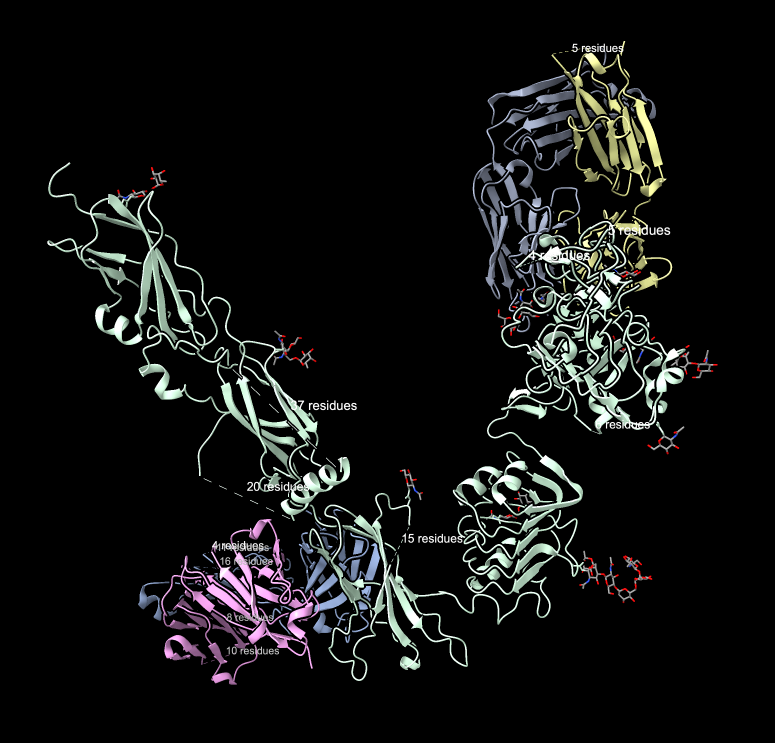
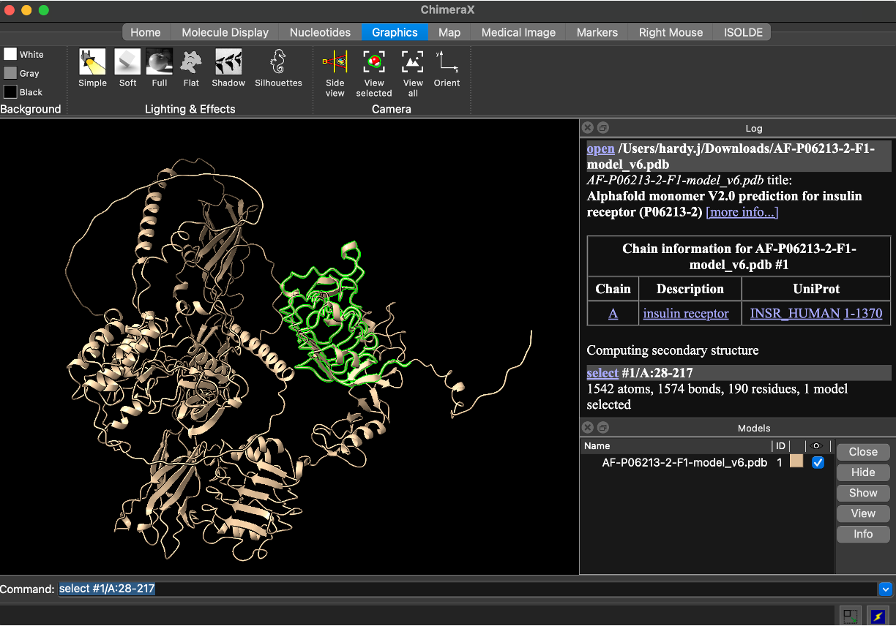
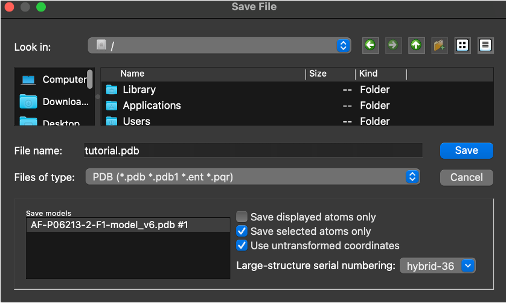
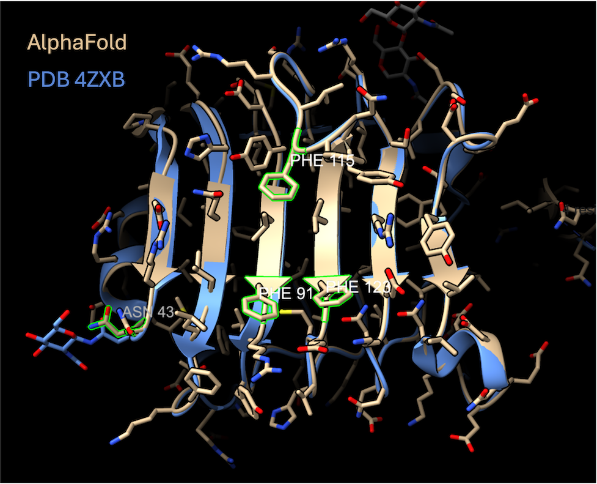
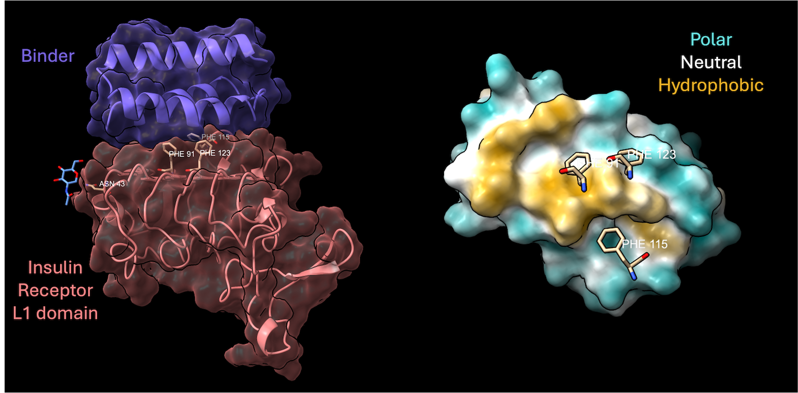

[🏠 ProteinDJ](../README.md) > De novo Binder Design Tutorial

# De novo Binder Design Tutorial

- [De novo Binder Design Tutorial](#de-novo-binder-design-tutorial)
  - [Installation and configuration ](#installation-and-configuration-)
  - [Target preparation ](#target-preparation-)
    - [Cropping input structures ](#cropping-input-structures-)
    - [Choosing hotspots ](#choosing-hotspots-)
    - [Deciding on design length ](#deciding-on-design-length-)
  - [Small scale test ](#small-scale-test-)
  - [Understanding the output and metrics ](#understanding-the-output-and-metrics-)
  - [Filtering designs ](#filtering-designs-)
  - [Scaling up ](#scaling-up-)
  - [Ranking designs ](#ranking-designs-)
  - [Advanced options and features ](#advanced-options-and-features-)
    - [Alternative Fold Design Programs (BindCraft/RFdiffusion) ](#alternative-fold-design-programs-bindcraftrfdiffusion-)
    - [AlphaFold2 and Serial AF2-Boltz Prediction ](#alphafold2-and-serial-af2-boltz-prediction-)
    - [Flexible targets/IDRs ](#flexible-targetsidrs-)
  - [BindSweeper ](#bindsweeper-)

## Installation and configuration <a name="install-config"></a>

Check the instructions in [installation.md](../docs/installation.md) to install and configure ProteinDJ for your system/cluster

## Target preparation <a name="target-prep"></a>

Before you begin design binders, you need to prepare a target protein structure. The success of binder design depends greatly on the quality of the input model and how well it represents the protein in solution. Proteins with large intrinsically disordered regions (IDRs) are much harder to work with since the conformations and positions of these parts is not certain. Similarly, proteins with post-translation modifications (e.g. phosphorylation, glycosylation) on their surface may inhibit protein-protein interactions. Be mindful of this when selecting an experimental structure and also check if the protein was modified/tagged/truncated from it's natural state which you may be targeting in vitro/in vivo. If your experimental structure is missing residues, a common rescue approach is to use [template-guided structure prediction](https://www.ebi.ac.uk/training/online/courses/alphafold/advanced-modeling-and-applications-of-predicted-protein-structures/customising-alphafold-structure-predictions/) to replace them (e.g. using AlphaFold/Boltz). If you suspect the absence of the residues in the structure is due to flexibility (often indicated in a structure prediction by \< 50 [pLDDT](https://www.ebi.ac.uk/training/online/courses/alphafold/inputs-and-outputs/evaluating-alphafolds-predicted-structures-using-confidence-scores/plddt-understanding-local-confidence/)), record the residue ranges so that you can use this during design. 

Binder design algorithms runtime and memory requirements can scale exponentially with the size of your input, so it is common practice to trim structures down to the domain(s) of interest. Overcropping, especially when it leaves incomplete folds with exposed inner residues can lead to issues with structure prediction so there is a balance.

For this tutorial, we are starting with a crystal structure of the insulin receptor [(PDB: 4ZXB) by Croll et al.](https://www.rcsb.org/structure/4ZXB). This structure has some of the issues highlighted above: missing residues and glycosylation sites, with many domains to choose from across the 768 residues. We can design binders against any of these domains, avoiding glycans and patching missing areas as needed. For the purposes of this tutorial we are interested in the first domain (E1-190). 



However, this crystal structure has missing residues in domain 1. ProteinDJ will interpret the input like this E1-162/E168-172/E177-190 and will not fill in missing residues, treating the small E168-172 fragment as an isolated segment rather than a continuous part of the domain. These chain breaks can distort contig/hotspot placement and confuse structure prediction, particularly for such a short fragment. As described earlier, we can use structure prediction to complete our target structures and the AlphaFoldDB entry on human insulin receptor (https://alphafold.ebi.ac.uk/entry/AF-P06213-2-F1) is a good match (0.44 Calpha RMSD), so we will use this file instead. Note that this prediction includes the signal peptide (1-27) that is cleaved during expression, so domain 1 is 28-217.

> **Note on numbering:** switching from the crystal structure to the AlphaFold model also changes the chain ID (`E` → `A`) and the residue numbering (AlphaFold/UniProt numbering includes the 27-residue signal peptide, so it runs 27 residues ahead of the mature-protein numbering used for the crystal structure). All residue numbers used for the rest of this tutorial - the crop range, hotspots, and anti-hotspot - refer to the AlphaFold model's chain `A` numbering. To convert an AlphaFold/UniProt residue number back to the equivalent crystal-structure residue, subtract 27.

### Cropping input structures <a name="crop"></a>

Download the AlphaFoldDB prediction of human insulin receptor (https://alphafold.ebi.ac.uk/entry/AF-P06213-2-F1) as a PDB file

In ChimeraX (or using equivalent commands in program of choice):

Select a domain of interest using the sequence viewer or commandline:

```
select #1/A:28-217
```

File -> Save -> Select PDB from 'Files of type' and tick 'Selected atoms only' -> Save (e.g. 'tutorial.pdb')

Alternatively, you can delete everything that you do not want to pass to ProteinDJ and save all atoms (default). If you have an experimental structure (crystallography/cryo-EM) you might need to delete ligands and non-standard residues too:
Select -> Residues -> All nonstandard
Actions -> Atoms/Bonds -> Delete

Upload/copy this file to your ProteinDJ project directory





### Choosing hotspots <a name="hotspots"></a>

You may have a particular binding site in mind for your target protein. To guide the binder design programs to a location we need to provide surface hotspot residues. In ProteinDJ, you can provide a chain-qualified residue e.g. 'A56', a chain-qualified range e.g. 'A115-120', or a bare chain ID meaning the whole chain e.g. 'B', or a combination e.g. 'A56,A115-120,B'. This means that the binder design will try to be within a short distance e.g. 5-7 angstroms from each of these residues but not exclusively to these residues. It is sufficient to provide 2-4 residues spread across a binding site, rather than exhaustively listing every residue on the surface. If hotspots are not provided (i.e. `hotspot_residues=null`) then the binder design program will select a site automatically. Often it will gravitate towards hydrophobic patches or known protein-protein interaction sites from structures in the PDB, which these models were trained on. It is useful to try different hotspots locations when working with a new target and seeing how this affects the success rates downstream. 

In this example our crystal structure is helpful to our design constraints as we can see sites of glycosylation. we will choose hotspots to avoid nearby glycosylation sites and interfaces that are near adjacent domains: hotspot_residues='A91,A115,A123'. These three phenylalanine residues form part of a hydrophobic patch that bind to the α-CT helix and the goal of our binders is to disrupt this interaction. We will also take note of the glycan position at A43 and use that as a site to avoid (bg_not_binding_residues = 'A43')



### Deciding on design length <a name="design-length"></a>

For de novo binder design, you must provide a desired length (or range) for binders. This also affects the time needed for computation as it contributes to the exponential memory use and runtime that we see with large target structures. You also need to consider the downstream use of the designs, as gene synthesis costs usually increase with length. It is difficult to reduce the size of binders after design without compromising their folding/binding.

However, if the binders become too small they will be more like peptides rather than folded domains, which could lead to issues with expression/solubility, or they may simply lack sufficient buried surface area or shape complementarity with the target. We usually start with a range for binder design (e.g. 60-150), so that we sample different sizes. If you notice that you can achieve high prediction confidence and good buried surface area with smaller binders, then reducing this range will save you significant time. 

## Small scale test <a name="small-scale-test"></a>

Now that we have prepared our target structures, identified our hotspots, and decided on a binder length range, we are ready to begin binder design. There are multiple ways you can interact with ProteinDJ/Nextflow:
 - Passing input parameters to the commandline
 - Using a config file or profile
 - Using a webserver like Seqera

Let's use the commandline to start a short binder design run on our target using RFdiffusion (rfd_denovo mode). Using 4 A30 GPUs this takes about 7-10 minutes:
```shell
# Use the path to your PDB file
nextflow run main.nf -profile test --design_mode 'boltzgen_denovo' --input_pdb 'tutorial/tutorial.pdb' --hotspot_residues 'A91,A115,A123' --bg_not_binding_residues 'A43' --design_length '60-150' --out_dir 'tutorial_test'
```

Note that the single hyphen parameter ('-profile') is directed to Nextflow, and the double hyphen parameters (--design_mode, --input_pdb, --hotspot_residues etc.) are directed to ProteinDJ. The test profile simply reduces the number of designs and sequences per design, and reads as follows:

```groovy
test {
    // base configuration for testing
    params {
        num_designs = 4
        seqs_per_design = 2
    }
}
```

There is a hierachy for Nextflow with commandline parameters overriding profile values and profile values overriding the default values in the nextflow.config. In the above example, num_designs normally defaults to 16 so this profile reduces the number to 4.

Rather than repeating these target-specific values on the command line, we can put them in a Nextflow params file. We keep profiles for execution environments and stable presets such as `slurm`, `apptainer`, `test`, and `example_filters`; parameters specific to this target and run belong in the params file.

tutorial/tutorial.yaml
```yaml
design_mode: 'boltzgen_denovo'
input_pdb: 'tutorial/tutorial.pdb'
hotspot_residues: 'A91,A115,A123'
bg_not_binding_residues: 'A43'
design_length: '60-150'
out_dir: 'tutorial_test'
```

Pass this file to Nextflow with `-params-file`. This command is equivalent to the short test we ran above:

```shell
nextflow run main.nf -profile test -params-file tutorial/tutorial.yaml
```

This keeps the biological inputs separate from the Nextflow profiles and makes it clear which settings belong to this design. Command-line parameters can still be used to override individual values for a particular run.

## Understanding the output and metrics <a name="output-metrics"></a>

In the 'tutorial_test' folder that was created earlier, you will find the outputs of ProteinDJ organised as below:

```
out_dir/
├── configs/                  # Config files used for run
├── inputs/                   # Input files used in run e.g. PDB files for binder design
├── run/                      # Intermediate results and log files with subfolders for each process
├── results/                  # Final results and metadata
    ├── best_designs.tar.gz   # Archive containing PDB files of designs that passed all filters
    ├── ranked_designs.tar.gz # Archive containing ranked PDB files of designs that passed all filters
    ├── all_designs.csv       # CSV file with metadata for all designs
    ├── best_designs.csv      # CSV file with metadata for designs that passed all filters
    └── ranked_designs.csv    # CSV file with metadata for ranked designs that passed all filters
└── nextflow.log              # Copy of Nextflow log from run
```

Most of the time we are interested in the files in 'results' as this contains the final predictions of our best binders and the metrics for all the designs. In this case, since we did not enable any filters, all of our designs passed, and all_designs.csv is identical to best_designs.csv. If you generate more high-quality designs than you need, you can use the ranked designs in ranked_designs.csv to select your favourites. 

Let's examine all_designs.csv (you can use VS Code or Excel or a text editor). The first row is the header and contains the names of all the metrics, and each subsequent row represents a single design with all the metrics. Each design has a unique fold_id and seq_id that form part of the name of the output PDB file, along with the structure prediction program e.g. 'fold_1_seq_0_boltzpred.pdb'. In the subsequent columns are the scores for the design, mostly consisting of the prediction scores by Boltz. As diffusion is a stochastic process, your scores will differ but in my case half of the designs had very low confidence and half had much higher confidence.

description | fold_id | seq_id | fold_helices | fold_strands | fold_total_ss | fold_RoG | mpnn_score | seq_ext_coef | seq_length | seq_MW | seq_pI | boltz_conf_score | boltz_rmsd_overall | boltz_rmsd_binder | boltz_rmsd_target | boltz_ipSAE_min | boltz_LIS | boltz_pDockQ2_min | boltz_pae_interaction | boltz_pde | boltz_ipde | boltz_plddt | boltz_iplddt | boltz_ptm | boltz_iptm | boltz_ptm_binder | boltz_ptm_target | pr_helices | pr_strands | pr_total_ss | pr_RoG | pr_intface_BSA | pr_intface_shpcomp | pr_intface_deltaG | pr_intface_deltaGtoBSA | pr_intface_hbonds | pr_intface_unsat_hbonds | pr_SAP | pr_SAP_complex | pr_surfhphobics | sequence | mpnn_time
-- | -- | -- | -- | -- | -- | -- | -- | -- | -- | -- | -- | -- | -- | -- | -- | -- | -- | -- | -- | -- | -- | -- | -- | -- | -- | -- | -- | -- | -- | -- | -- | -- | -- | -- | -- | -- | -- | -- | -- | -- | -- | --
fold_0_seq_0_boltzpred | 0 | 0 | 4 | 2 | 6 | 11.15 | 0.67 | 2980 | 82 | 8923 | 4.59 | 0.918 | 1.51 | 0.69 | 0.63 | 0.521 | 0.596 | 0.626 | 5.3 | 0.35 | 1.89 | 0.932 | 0.927 | 0.936 | 0.858 | 0.976 | 0.97 | 4 | 2 | 6 | 11.43 | 840 | 0.667 | -7.65 | -0.0091 | 8 | 14 | 0.549 | 0.272 | 31.1 | MVSAEEAAEAVRKAVLERYGEVATTEQAQEVVREVGRELGLPEDFIELAEFYVEMLGRKNGGKVTAEQVAEAVRKAAELTGV | 19
fold_0_seq_1_boltzpred | 0 | 1 | 4 | 2 | 6 | 11.15 | 0.77 | 2980 | 82 | 9064 | 4.34 | 0.897 | 1.7 | 0.52 | 0.28 | 0.288 | 0.417 | 0.333 | 7.53 | 0.39 | 3.18 | 0.933 | 0.922 | 0.901 | 0.752 | 0.976 | 0.966 | 4 | 2 | 6 | 11.52 | 832 | 0.644 | -8.13 | -0.0098 | 4 | 19 | 0.577 | 0.287 | 28.9 | MPKAEEIAERVKERMLEEYGEEATGEQAQEVVREVGEELGLPEELTELAQFYVEMIARKNGGKVTAEQVGEAVKEAAELLGV | 17
fold_1_seq_0_boltzpred | 1 | 0 | 2 | 11 | 13 | 13.23 | 0.91 | 23950 | 120 | 12676 | 5.84 | 0.832 | 14.84 | 1.14 | 0.66 | 0.012 | 0.107 | 0.04 | 11.9 | 0.47 | 5.43 | 0.885 | 0.824 | 0.826 | 0.62 | 0.977 | 0.968 | 3 | 11 | 14 | 13.37 | 1190 | 0.539 | -10.54 | -0.0089 | 16 | 30 | 0.441 | 0.224 | 41.6 | AVTLTESGGGTVPVGGSVRLSSSVSGVDVSKHGLGWWRQQPGKVPRFVASISSDGTETLYADDVKGRFTISRDAAANTAYLDMKNLEKSDTATYYSGLSAYPGELVVHDHWGQGTQLTVV | 19
fold_1_seq_1_boltzpred | 1 | 1 | 2 | 11 | 13 | 13.23 | 0.91 | 16960 | 120 | 12882 | 6.13 | 0.821 | 17.91 | 0.62 | 0.46 | 0 | 0 | 0 | 15.47 | 0.52 | 8.6 | 0.903 | 0.827 | 0.77 | 0.496 | 0.977 | 0.971 | 2 | 11 | 13 | 13.43 | 602 | 0.688 | -8.88 | -0.0147 | 5 | 12 | 0.404 | 0.251 | 35.6 | AVTITESGGGSVPVGGSVRLSGKVSGVDISKHGLGWFRQKPGKPMEFVASISSDGKKTLYADEVKGRFTISKDVAKNTIYLDMSNLKEEDTATYYNGISDFPNELFVMTHWGSGTELTVS | 18
fold_2_seq_0_boltzpred | 2 | 0 | 4 | 11 | 15 | 14.06 | 0.77 | 14440 | 141 | 14344 | 4.1 | 0.868 | 2.8 | 2.75 | 0.36 | 0.397 | 0.385 | 0.249 | 8.39 | 0.37 | 2.58 | 0.908 | 0.893 | 0.86 | 0.711 | 0.965 | 0.972 | 3 | 11 | 14 | 14.29 | 744 | 0.626 | -9.01 | -0.0121 | 2 | 14 | 0.397 | 0.244 | 35.7 | AITVTESGGGTFLSGSSVTLSAKVSGADLSSYALGWLRQKPGEKGEAVAAISADGSETFYSDEVEGRATISVDFSTQTVYLTLSNLTPEDTATYYAVLGKAGSTGLEVYLGGTFFGDDDSIFTAVGAGTQLTVSDSGTVPK | 20
fold_2_seq_1_boltzpred | 2 | 1 | 4 | 11 | 15 | 14.06 | 0.85 | 25440 | 141 | 14772 | 4.49 | 0.929 | 2.34 | 3.26 | 0.37 | 0.806 | 0.648 | 0.887 | 5.01 | 0.32 | 0.78 | 0.933 | 0.943 | 0.943 | 0.898 | 0.967 | 0.978 | 4 | 11 | 15 | 14.43 | 688 | 0.691 | -7.48 | -0.0109 | 5 | 10 | 0.547 | 0.324 | 36.9 | KIVLKESGGGTVLTGGSVTLTSQVSGVDLSKYAWGWIRQKPGEPGEAVAAISKDGSETFYSSSIEGRATISVDFSKSTVYLTLNNLRPEDTATYYSVLGEEGSTALEVYLAGTFFGGDKSVFVAWGEGTELTVLSDGVAPE | 19
fold_3_seq_0_boltzpred | 3 | 0 | 2 | 5 | 7 | 11.73 | 0.89 | 8940 | 81 | 9238 | 4.97 | 0.844 | 19.22 | 2.49 | 1.12 | 0.094 | 0.141 | 0.045 | 12.15 | 0.59 | 6.8 | 0.899 | 0.811 | 0.837 | 0.62 | 0.939 | 0.963 | 1 | 5 | 6 | 12.55 | 821 | 0.673 | -9.54 | -0.0116 | 6 | 23 | 0.724 | 0.593 | 35.6 | MIPEEVKIKVVLPNGEVIELTVKSSETIYELKEKLEEIKGIDPKYAVLVYNGKFLEDDKTLADYGIKDGDTLYLATYKLKK | 19
fold_3_seq_1_boltzpred | 3 | 1 | 2 | 5 | 7 | 11.73 | 0.88 | 5960 | 81 | 8902 | 4.59 | 0.767 | 3.21 | 2.57 | 0.4 | 0 | 0 | 0 | 19.18 | 0.56 | 9.56 | 0.883 | 0.86 | 0.765 | 0.3 | 0.963 | 0.965 | 2 | 5 | 7 | 12.04 | 720 | 0.549 | -8.26 | -0.0115 | 1 | 18 | 0.555 | 0.369 | 37.7 | AVPETLTIKVVLPNGEVIELTVKASDTIQEVKEKLGEKVGLDPKTAVLYYNGKFLEDDKTLADYGIQDGDVLHLATYEKLP | 19

## Filtering designs <a name="filtering"></a>

By default, all filters are null – all designs will ‘pass’. For production runs, we need to provide cutoff values for our designs to filter out low confidence predictions. There are some example values in the example_filters profile (see below) that have been used as cutoff for binder design campaigns it is worth noting that this does not guarantee binding. Some targets are harder, and we can make compromises on filtering values otherwise the project has to be abandoned. As outlined in 'Target Preparation section' the input structure may not reflect the true protein structure/conformation, and structure prediction programs can be biased towards particular folds/complexes. Nevertheless, using these metrics to filter out bad designs has been shown to improve success rates even though some binder design campaigns still fail. 

Types of prediction filters:
- RMSD/Alignment – e.g. binder_bndaln, binder_tgtaln
- Overall confidence e.g. plddt, ptm
- Interface confidence e.g. pae_interaction, iptm
- Biophysical metrics e.g. secondary structures, buried surface area, hydrogen bonds etc.

Aside from structure prediction filters, there are other aspects of the workflow you can modulate. RFdiffusion can sometimes generate 1 or 2 helix designs, rather than folded binder domains. These have a high failure rate downstream and unless you are intentially designing peptides, it saves time filtering them out before sequence design and structure prediction. BoltzGen/BindCraft are less prone to this. 

Another biophysical metric that is of practical use is the extinction coefficient of the binder ('seq_min_ext_coef'). Sometimes binders will have sequences that lack residues that can absorb UV light (Trp/Tyr/Phe/Cys) and this will make them invisible using UV detection methods (e.g. spectroscopy, column chromatography). If your construct/tags that you plan to use with your binders does not absorb UV light either, you might want to include 'seq_min_ext_coef=1000' to ensure that the designed sequence contains at least one aromatic residue before passing it to the structure prediction and analysis stages.

You should also pay attention to the buried surface area (BSA) and shape complementarity (sc) to ensure that the binders have a good interaction with the target. The hydrophobicity of the binder can lower its solubility and limit expression. In addition to the % hydrophobic surface area, we calculate the Spatial Aggregation Potential (SAP) for the binder, higher indicating a greater chance of insolubility. If you are binding a hydrophobic target site such as in this tutorial then your binder may be more hydrophobic - the SAP_complex score excludes these interface residues from the calculation and reflects the solubility of the binder when bound to the target.

You can create your own custom filtering profile and adjust it to your needs. For this tutorial we will use the example_filtes profile that contains a variety of preset values for fold filtering, sequence filtering, and prediction filtering: 

```groovy
example_filters {
    params {
        fold_min_ss = 3
        seq_min_ext_coef = 1000
        af2_max_pae_interaction = 10
        af2_min_iptm = 0.7
        af2_min_plddt_overall = 90
        af2_max_rmsd_binder_bndaln = 1.5
        af2_max_rmsd_binder_tgtaln = 2.5
        boltz_min_ptm_binder = 0.9
        boltz_min_iptm = 0.8
        boltz_max_rmsd_binder = 1.5
        boltz_max_rmsd_overall = 2.5
    }
}
```

## Scaling up <a name="scaling-up"></a>

Now that we have completed a test run, and checked our outputs are what we intended, we can perform a larger scale run. Many targets will not have hits with only 4*2 designs, so we always need to increase the number of designs. 

Previously we used the test profile. If we omit this profile, the default values in nextflow.config will be used: 16 folds * 8 sequences = 128 designs total. This is a good number for testing a hotspot, to find something with a hit rate of > 1% within an hour, depending on how many GPUs you have access to. It also allows us to test our filtering values and adjust them if needed.

We will use our params file with the `example_filters` profile from `nextflow.config`. This took about 20-25 minutes on 4 A30 GPUs.

```shell
nextflow run main.nf -profile example_filters -params-file tutorial/tutorial.yaml
```

Looking at the summary, all folds passed but of the 16*8=128 sequences, only 109 had an extinction coefficient of > 1000, and only 28 of those passed structure prediction filters. 

```
Pipeline results summary:
* Fold designs generated by BoltzGen: 16
* Fold designs after filtering: 16
* Sequence designs generated by MPNN (Folds * 8): 128
* Sequence designs after MPNN filtering: 109
* Predictions generated by BOLTZ: 109
* Predictions after BOLTZ filtering: 28
* Final predictions after Analysis filtering: 28
* After Ranking, will output all 28 designs
```

If you don't see any designs pass, consider trying different hotspots, fold design programs (BindCraft/RFdiffusion) or adjusting filters if you see near misses. Before trying 1000s of designs which could take several days to complete you can try doubling or tripling the designs instead. If your project is restricted to a very specific hotspot and your success rate is low then you have no choice but to run larger numbers of designs.

To increase the number of designs, add `num_designs` to the params file or pass it on the command line. Numbers that split evenly over your GPUs are the most efficient:

```shell
nextflow run main.nf -profile example_filters -params-file tutorial/tutorial.yaml --num_designs 64
```

If running ProteinDJ from the commandline, you must ensure that your launch process is not interrupted as it coordinates the internal processes. We recommend using screen/tmux to allow Nextflow to run in a subshell. If you get disconnected, you can use the '-resume' option with Nextflow to load cached results. A process must fully complete for the cache to be valid.

```shell
nextflow run main.nf -profile example_filters -params-file tutorial/tutorial.yaml -resume
```

## Ranking designs <a name="ranking"></a>

You can rank designs using any structure prediction metric, although we default to af2_pae_interaction (AF2) or boltz_ipSAE_min (Boltz) based on recommendations from the literature. Two other parameters affect the ranking: max_designs and max_seqs_per_fold. Max_designs simply limits the number of designs in the output but max_seqs_per_fold limits the number of sequences that make the final list for the same fold. Setting this to 2-4 can be useful to increase fold diversity as some folds may be highly successful with almost all sequences passing structure prediction.

Remember that you can always adjust your ranking after the designs are run by sorting/filtering the CSV file. The binder sequences are embedded in the CSV file making it easy to compile a list of your favourite designs.

Here is an example of a highly confident binder (ipSAE=0.734, pae_interaction=4.28, iptm=0.923, rmsd_overall=0.73). Although this binder is small and contains only 61 residues it still has a buried surface area of 913 Å with a shape complementarity of 0.71/1. It is also near the hotspots were designed against an away from the glycan we were trying to avoid. However, since this target patch is mostly hydrophobic, the binder has a hydrophobic surface to match (SAP=0.89/1, SAP_complex=0.39/1) which may affect its solubility, especially if expressed without the target protein.



## Advanced options and features <a name="advanced"></a>

### Alternative Fold Design Programs (BindCraft/RFdiffusion) <a name="alt-fold-design"></a>

One of the advantages of ProteinDJ is that there are multiple software available for binder design. If you want to try BindCraft, it is as easy as changing the design mode to 'bindcraft_denovo' (or 'rfd_denovo' for RFdiffusion) and it will use the same hotspots and input PDB as for BoltzGen. Make sure to change the output directory to prevent your previous results being overwritten.

```
nextflow run main.nf -profile example_filters -params-file tutorial/tutorial.yaml --design_mode 'bindcraft_denovo' --out_dir 'tutorial_bindcraft'
```

Each software has advantages and disadvantages. RFdiffusion is as fast as BoltzGen but has a tendency for helical binders, partially fixed by using the checkpoint override (rfd_ckpt_override='complex_beta'). BindCraft has a higher success rate for structure prediction than RFdiffusion due to its iterative design cycle, but takes much longer than RFdiffusion/BoltzGen to generate each fold. BoltzGen is the newest of the three and can generate a higher diversity of folds, incorporating more beta-sheets than RFdiffusion, and also has the option to provide anti-hotspots (bg_not_binding_residues), helping restrict the design to interacting with your intended site.

### AlphaFold2 and Serial AF2-Boltz Prediction <a name="af2-boltz"></a>

We have integrated two different structure prediction programs: AlphaFold2 initial-guess and Boltz-2. AlphaFold2 Initial-Guess is a modified version of AlphaFold2 that skips the MSA generation step, to speed up inference of the design. It preserves the target chain from the input, but the binder structure is masked/hidden and only the sequence is provided. For flexible target proteins or induced-fit binders, this is restrictive as the target chain cannot adopt different conformations during prediction. Hence we configured Boltz-2 to co-fold the target and the binder, using template guidance for the target (boltz_use_templates = true) but not the binder. We recommend trying both for your target, and you can even use a combination (pred_method = 'af2_boltz') which will run AlphaFold2 first, filter designs, then pass the surviving designs to Boltz-2 for another round of prediction and filtering.

### Flexible targets/IDRs <a name="flexible-targets"></a>

In this tutorial, we worked with a well-folded domain lacking the flexible/dynamic parts that are found in many proteins. If your target contains flexible loops near your binding site or you are trying to bind a flexible loop, you need to adjust the parameters to (a) tell the design program it is flexible and (b) relax RMSD filters to compensate for this flexibility in the structure prediction. 

For RFdiffusion/BoltzGen you can specify the flexible residues which could be individual residues, part of a chain or a whole chain e.g. flexible_residues='A10-13,B16,C' Their position will be masked during diffusion but the sequence is retained. For BindCraft, you can use the flexible protocol (bc_template_protocol = 'flexible') which will globally allow the target prediction to change. 

Any RMSD calculations that include the flexible regions of the target will naturally be higher e.g. af2_rmsd_overall, af2_rmsd_target, boltz_rmsd_overall, boltz_rmsd_target. so you may need to adjust the filters for these metrics.

## BindSweeper <a name="bindsweeper"></a>

After running a few individual ProteinDJ jobs, we would encourage you to explore BindSweeper (see [bindsweeper.md](../docs/bindsweeper.md) for installation instructions). BindSweeper is a tool designed for power users, it is a python wrapper around ProteinDJ that allows parallel execution of different parameters and reports the success rates of each combination. Its YAML format is similar to a Nextflow params file, but adds a `mode`, an optional `profile`, and separate `fixed_params` and `sweep_params` sections. Use a separate file because this structure is interpreted by BindSweeper rather than passed directly to Nextflow.

For example, you could test with or without hotspots with a yaml file like this:

tutorial/tutorial_sweep.yaml
```yaml
mode: boltzgen_denovo #design mode
profile: example_filters #Profiles that you are using in nextflow.config

fixed_params: # Parameters used for every run
  design_length: '60-150' 
  input_pdb: 'tutorial/tutorial.pdb'
  bg_not_binding_residues: 'A43'

sweep_params: # Parameters to sweep
  hotspot_residues:
    values:
      - null
      - 'A91,A115,A123'
```

Then point bindsweeper to the yaml file and provide an output path. This will launch two ProteinDJ jobs in parallel
```shell
bindsweeper --config tutorial/tutorial_sweep.yaml --output-dir bindsweeper_tutorial/
```

You can of course add more hotspots the list, but you can also add additional parameters and Bindsweeper will create a matrix sweep testing all combinations. For example, if we had two different versions of a protein structure, maybe from different structure prediction programs, we can provide them both e.g.

```yaml
sweep_params: # Parameters to sweep
  hotspot_residues:
    values:
      - null
      - 'A91,A115,A123'
  input_pdb:
    values:
      - 'structure1.pdb'
      - 'structure2.pdb'
```

This will create four ProteinDJ runs: with/without hotspots for both structure 1 and structure 2.

Sometimes you may want to provide specific values for a sweep parameter e.g. structure 1 and 2 have different sequence indexes so the hotspot residue numbers differ. You can use the paired_values key:

```yaml
sweep_params: # Parameters to sweep
  input_pdb:
    values:
      - 'structure1.pdb'
      - 'structure2.pdb'
    paired_with: # One for each of the above
      hotspot_residues:
        - 'A91,A115,A123'
        - 'A99,A123,A131'
```

## References

Croll TI, Smith BJ, Margetts MB, Whittaker J, Weiss MA, Ward CW, Lawrence MC. Higher-Resolution Structure of the Human Insulin Receptor Ectodomain: Multi-Modal Inclusion of the Insert Domain. Structure. 2016 Mar 1;24(3):469-76. doi: 10.1016/j.str.2015.12.014. Epub 2016 Feb 12. PMID: 26853939; PMCID: PMC4860004.

Bertoni D. et al. AlphaFold Protein Structure Database 2025: a redesigned interface and updated structural coverage,  Nucleic Acids Research, Volume 54, Issue D1, 6 January 2026, Pages D358–D362, https://doi.org/10.1093/nar/gkaf1226